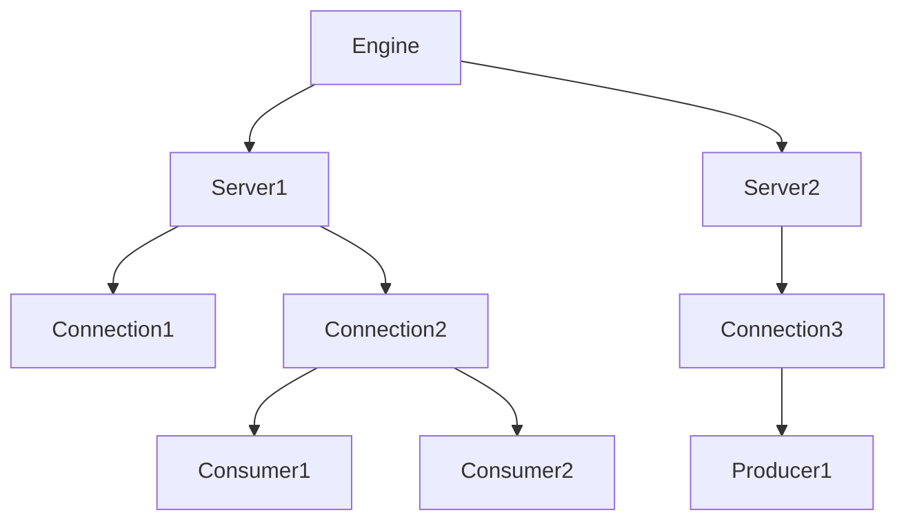

# Simple Hardware-Offloading Coroutines (SHOC) for Bluefield DPUs

This repo contains a SHOC implementation for Bluefield DPUs, a C++ toolkit for simpler DOCA development built around C++20 coroutines.
It is supplementary to the corresponding short paper submission to USENIX ATC 2025.

This README assumes familiarity (at least in broad strokes) with the core concepts of the DOCA SDK.

## Reproduction of Experimental Results

The experiments from the short paper can be reproduced on a system with a Bluefield-2 DPU. The exact measured
data rates depend on the setup.

To reproduce the experiments, this repository must be built on both host and DPU, since some experiments
involve DPU-side server processes. On both sides, spin up a DOCA base image as desribed
[here](https://docs.nvidia.com/doca/sdk/nvidia+doca+developer+guide/index.html). Use versions 2.9.1-devel and
2.9.1-devel-host, respectively.

On the DPU side, go to the source directory and run:

```
  bash build.sh
  export DOCA_DEV_PCI=<dpu-side-pci-address>
  export DOCA_DEV_REP_PCI=<host-side-pci-address>
```

On the host side

```
  bash build.sh
  export DOCA_DEV_PCI=<host-side-pci-address>
  bash experiments/compression.sh
  bash experiments/comch.sh
  bash experiments/dma_client.sh
```

The comch and dma experiments will prompt you to start appropriate server processes on the DPU before they start their
trial runs.

Afterwards, per-trial results are in the `results` subdirectory. A summary can be generated with

```
  bash experiments/postprocess.sh compression
  bash experiments/postprocess.sh comch
  bash experiments/postprocess.sh dma
```

The columns of the summary correspond to table 1 in the short paper.

## Notes about reproduction on Bluefield-3

We got access to a BF-3 card only shortly before submission of the paper, so all experimental results in the paper
were obtained on a Bluefield-2. SHOC is not limited to BF-2, but we ran into some compatibility issues with the experiments:

1. Deflate compression is no longer available on Bluefield-3, so the compression experiment does not work there.

2. The comch experiment client side triggers a bug in DOCA 2.9: the consumer's start event is lost on BF-3
when the `epoll`-based waiting mechanism is used. This can be worked around in SHOC by replacing the `wait` method in
`shoc/progress_engine.cpp` with

```c++
auto progress_engine::wait([[maybe_unused]] int timeout_ms) -> void {
    return epoll_.wait(0);
}
```

and in plain DOCA by removing from function `receive_datastream` in `progs/plain_doca/comch_data_client/client.c` the calls
to `doca_request_notification` and `doca_clear_notification` and setting the epoll timeout to 0:

```c
    // doca_pe_request_notification(engine);
    nfd = epoll_wait(epoll_fd, &ep_event, 1, 0);

    ...
    // doca_pe_clear_notification(engine, 0);
```

However, this will cause the client to busy-wait and likely skew the experimental results.

3. The DMA experiment works out of the box, but 4 parallel tasks are not enough to saturate a Bluefield-3. To run the experiment
at saturation, amend `experiments/dma_client.sh` to start `bench/dma_client` and `bench/doca_dma_client` with a number greater than
4 as parameter for the parallel case. In our setup, 32 was enough.

## Motivation and Motivating Example

Bluefield DPUs come with the C-based DOCA SDK, a callback-based asynchronous
API. Coding directly for that API comes with the typical drawbacks of such
systems, that is:

- program logic is scattered around multiple callbacks
- each callback has to reconstruct the event context manually
- error handling in particular is fairly cumbersome
- cleanup of child contexts (e.g. consumer -> connection -> server) requires complicated tracking
- ...

All in all, it's not a straightforward programming model. Furthermore, the
DOCA SDK is generally thread-unsafe, so a thread-based promise/future programming
model is difficult to implement safely.

As such this toolkit attempts to solve the problem with

- a coroutine-based programming model and
- a hierarchical context model to keep track of parent/child relations and automate cleanup

For a motivating example, consider a simple comch client application that sends a ping message
and expects a pong message in return. In a plain DOCA application, the program logic would be
split across the following callbacks:

- a state-change callback on the client context to find out when the context is started and send the ping message. This
  same callback would also handle stopping the client.
- send-completion and send-error callbacks to know when the message was sent and whether sending succeeded
- a message-received callback to get and handle the response

By contrast the coroutines-based model allows us to keep the whole logic in a single place:

```c++
#include "shoc/comch/client.hpp"
#include "shoc/coro/fiber.hpp"
#include "shoc/logger.hpp"
#include "shoc/progress_engine.hpp"

#include <iostream>

auto ping_pong(shoc::progress_engine *engine) -> shoc::coro::fiber {
    auto dev = shoc::comch::comch_device { "81:00.0" };

    // wait for connection to server, that is: create the context and ask the SDK to start
    // it, then suspend. The coroutine will be resumed by the state-changed handler when
    // the client context switches to DOCA_CTX_STATE_RUNNING.
    auto client = co_await engine->create_context<shoc::comch::client>("shoc-test", dev);
    // send message, wait for status result
    auto status = co_await client->send("ping");

    if(status != DOCA_SUCCESS) {
        shoc::logger->error("could not send ping: = {}", doca_error_get_descr(status));
        co_return;
    }

    // wait for response and print it
    auto msg = co_await client->msg_recv();
    std::cout << msg << std::endl;

    // client stops automatically through RAII. If code needs to happen after the client
    // is stopped, co_await client->stop() is possible.
}

int main() {
    auto engine = shoc::progress_engine {};

    // spawn coroutine. It will run up to the first co_await, then control returns to main.
    ping_pong(&engine);

    // start event processing loop. This will resume the suspended coroutine whenever an
    // event is processed that concerns it. By default the main loop runs until all
    // dependent contexts are stopped.
    engine.main_loop();
}
```

On the server side, a plain DOCA application would additionally have to keep track of the
different connections it has accepted. In the coroutines-based model it's as simple as 
spawning a new coroutine:

```c++
#include "shoc/comch/server.hpp"
#include "shoc/coro/fiber.hpp"
#include "shoc/progress_engine.hpp"

#include <iostream>
#include <string_view>

auto ping_pong(shoc::comch::scoped_server_connection con) -> shoc::coro::fiber {
    auto msg = co_await con->msg_recv();
    std::cout << msg << std::endl;
    auto status = co_await con->send("pong");

    if(status != DOCA_SUCCESS) {
        shoc::logger->error("failed to send response:", doca_error_get_descr(status));
    }

    // connection cleaned up through RAII when the fiber ends. Again, 
    // co_await con->disconnect(); is possible when required.
}

auto serve_ping_pong(shoc::progress_engine *engine) -> shoc::coro::fiber {
    auto dev = shoc::comch::comch_device { "03:00.0" };
    auto rep = shoc::device_representor::find_by_pci_addr ( dev, "81:00.0" );

    auto server = co_await engine->create_context<shoc::comch::server>("shoc-test", dev, rep);

    for(;;) {
        // accept client connection
        auto con = co_await server->accept();
        // spawn new coroutine (fiber) to handle it. Again this will run up to the first co_await
        // and suspend, returning control here. It will be resumed when events concerning that
        // connection are processed by the engine.
        ping_pong(std::move(con));
    }
}

int main() {
    auto engine = shoc::progress_engine{};
    serve_ping_pong(&engine);

    engine.main_loop();
}
```

## Design

### Main Event Pump

Each DOCA application is built around the event processing loop of a progress engine: Some task is offloaded to the
hardware, and when the hardware is finished, an event will be generated to be handled the next time the progress engine
is made to handle events. Thus this library is built around the assumption that after an initial setup, everything happens
in the event loop and is handled by resumed coroutines.

The main event pump is single-threaded because the DOCA SDK is not threadsafe. The coroutine code can give the
impression of parallel code, but in fact the resumption of different coroutines is interleaved in a single thread.

### Offloading, Events and Awaitables

Every offloading operation (i.e., that is not guaranteed to finish synchronously) returns an awaitable object on which
`co_await` can be used. Most of the time it is useful to `co_await` immediately after offloading, but it is not
required to do so. See `progs/parallel_compress.cpp` for an example program where multiple tasks are offloaded in "parallel"
before the first awaitable is waited upon.

For each offloaded task, a receptable is generated and attached to the task (such that the SDK callbacks can find it). This
receptable stores a handle to the coroutine that is waiting on it (if any) and the result of the operation when it is
available. If a coroutine handle is associated with the receptable when the result is generated, that coroutine is
resumed. If the coroutine `co_awaits` only after the result is available, it is never suspended and just continues
working with that available result.

**Importantly**, the awaitable object owns the receptable and as such must be kept alive long enough for the completion
event to be processed (otherwise there's a use-after-free error). This is not a problem in the normal case where the
awaitable is immediately `co_await`ed upon, but otherwise take care that the `co_await` can only be delayed, not ommitted.

Similarly, there are operations that wait for something to happen from the outside, such as accepting new connections on
a server context. These too return awaitables for `co_await`ing, and the suspended coroutine will be resumed when the
event it is waiting for occurs. In these cases, if events occur while nobody is waiting, they will be queued until a
coroutine comes along to consume them.

### State Changes and Awaitables

State change awaitables are subtly different from offloading tasks in that

1. `start()` is not explicitly called by the user, but implicitly is a part of `context_create`.
2. `stop()` should happen even if it is not explicitly called or `co_await`ed upon
3. There is no task to which a receptable could be attached, only the context user data (i.e., the context object).

To facilitate 2., `create_context` returns a scoped wrapper around the context pointer that will call but not `co_await`
the context's `stop()` method.

Because of 3., in the case of a delayed `co_await` the context object must be kept alive long enough for the awaitable
to reference it potentially after the state-change event to `DOCA_CTX_STATE_IDLE` has been processed and the context
has been removed from its parent's active-children registry. Because of this, all contexts are jointly owned in
`std::shared_ptr`s by their parent and any state-change awaitables referring to them.

### Context Hierarchy

DOCA Contexts (and sometimes other resources, such as connections) are conceptually organized in a hierarchical fashion,
e.g. a comch server can accept several connections, and on each connection one can create several consumers and producers
for zero-copy sending of memory buffers:



In these cases, the DOCA SDK demands that the consumers are stopped before the connection is disconnected, and the
connections need to be disconnected before the server can be stopped.

In this library, stop requests are percolated down the context hierarchy such that all dependent contexts are stopped
before their parent finally stops. In the illustrated case `co_await server1->stop();` would send disconnect signals to
connections 1 and 2, which in turn would send stop signals to consumers 1 and 2. Connection 1 would be disconnected
immediately, but connection 2 would only be disconnected after the state-change events to `DOCA_CTX_STATE_IDLE` for
consumers 1 and 2 have been processed, and only after both connections are disconnected would server 1 be stopped. The
coroutine waiting for server stoppage would then be resumed when server 1 receives a state-change event to `DOCA_CTX_STATE_IDLE`.

For this to work, each context has to keep track of its child resources in an active-children registry that owns
the child-context objects. After they have been stopped, they are removed from that registry and destroyed (unless
there are context-state awaitables still referring to them, in wich case their destruction is delayed until those
no longer use them).
